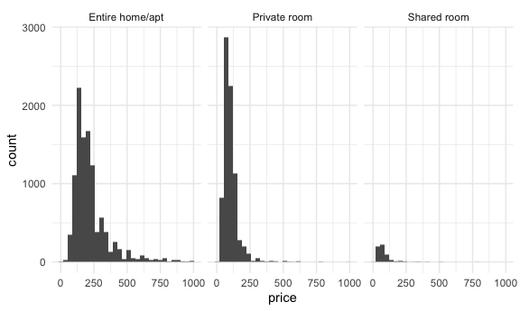
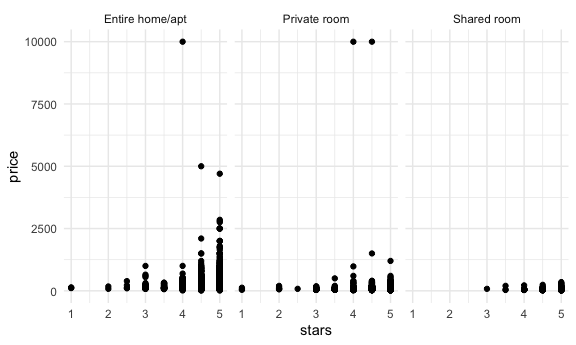
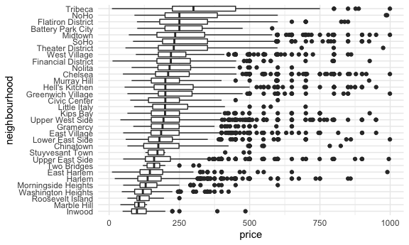
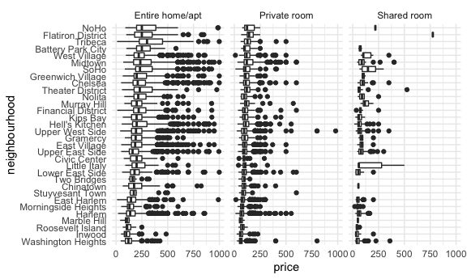
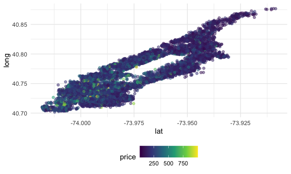

Case Study
================

Today we’re studying a case.

## Get Data

``` r
library(p8105.datasets)
data(nyc_airbnb)

nyc_airbnb = 
nyc_airbnb %>% 
  rename(borough = neighbourhood_group) %>% 
  mutate(
    stars = review_scores_location / 2
  )
```

Stat mean price for diff room types in diff borough:

``` r
nyc_airbnb %>% 
  group_by(borough, room_type) %>% 
  summarise(
    mean_price = mean(price, na.rm = TRUE)
  ) %>% 
  pivot_wider(
    names_from = room_type,
    values_from = mean_price
  )
```

    ## `summarise()` has grouped output by 'borough'. You can override using the
    ## `.groups` argument.

    ## # A tibble: 5 × 4
    ## # Groups:   borough [5]
    ##   borough       `Entire home/apt` `Private room` `Shared room`
    ##   <chr>                     <dbl>          <dbl>         <dbl>
    ## 1 Bronx                      125.           65.5          57.5
    ## 2 Brooklyn                   175.           76.7          59.6
    ## 3 Manhattan                  238.          107.           84.7
    ## 4 Queens                     140.           70.6          49.1
    ## 5 Staten Island              207.           65.4          25

Price Distribution:

``` r
nyc_airbnb %>% 
  filter(
    borough == "Manhattan",
    price < 1000
  ) %>% 
  ggplot(aes(x = price)) + 
  geom_histogram() +
  facet_grid(. ~ room_type)
```

    ## `stat_bin()` using `bins = 30`. Pick better value with `binwidth`.



Stars vs Price:

``` r
nyc_airbnb %>% 
  filter(borough == "Manhattan") %>% 
  ggplot(aes(x = stars, y = price)) + 
  geom_point() +
  facet_grid(. ~ room_type)
```



Price vs Neighbourhood Boxplot:

``` r
nyc_airbnb %>% 
  filter(borough == "Manhattan") %>% 
  group_by(neighbourhood) %>% 
  summarise(
    mean_price = mean(price, na.rm = TRUE)
  ) %>% 
  arrange(desc(mean_price))
```

    ## # A tibble: 32 × 2
    ##    neighbourhood     mean_price
    ##    <chr>                  <dbl>
    ##  1 Tribeca                 353.
    ##  2 Flatiron District       319.
    ##  3 NoHo                    302.
    ##  4 Greenwich Village       258.
    ##  5 SoHo                    256.
    ##  6 Midtown                 251.
    ##  7 West Village            239.
    ##  8 Chelsea                 233.
    ##  9 Theater District        232.
    ## 10 Battery Park City       221.
    ## # … with 22 more rows

``` r
nyc_airbnb %>% 
  filter(
    borough == "Manhattan",
    room_type == "Entire home/apt"
  ) %>% 
  filter(price < 1000) %>% 
  mutate(
    neighbourhood = fct_reorder(neighbourhood, price)
  ) %>% 
  ggplot(aes(x = neighbourhood, y = price)) + 
  geom_boxplot() +
  coord_flip()
```



``` r
nyc_airbnb %>% 
  filter(
    borough == "Manhattan"
  ) %>% 
  filter(price < 1000) %>% 
  mutate(
    neighbourhood = fct_reorder(neighbourhood, price)
  ) %>% 
  ggplot(aes(x = neighbourhood, y = price)) + 
  geom_boxplot() +
  coord_flip() + 
  facet_grid(. ~ room_type)
```



Price Distribution in lat & long:

``` r
nyc_airbnb %>% 
  filter(
    borough == "Manhattan",
    room_type == "Entire home/apt"
  ) %>% 
  filter(price < 1000) %>% 
  ggplot(aes(x = lat, y = long, color = price)) +
  geom_point(alpha = .5)
```



## Brainstorm questions
